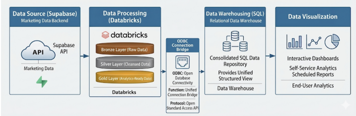
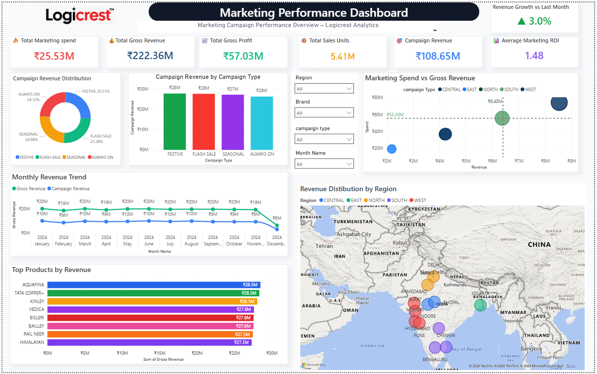
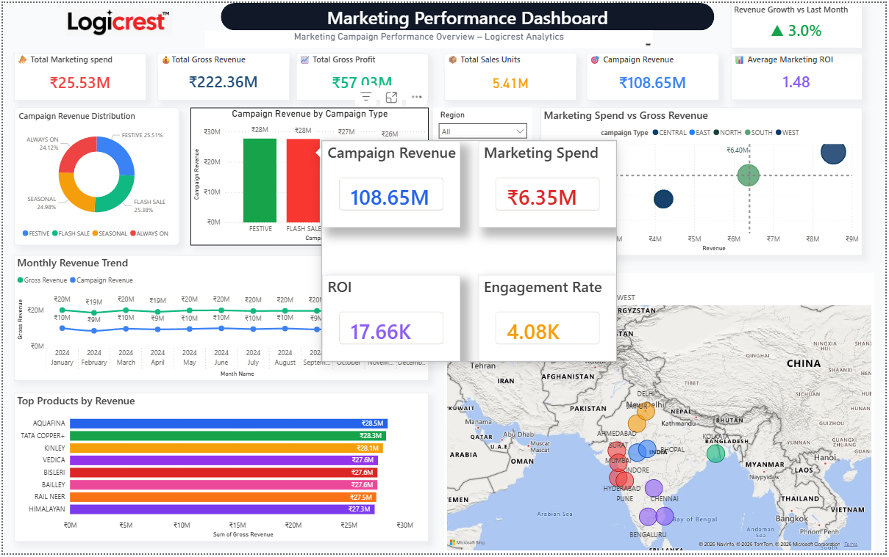
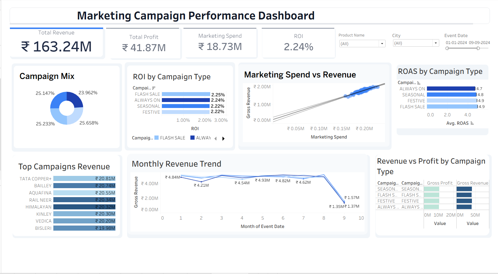

# End-to-End Marketing Analytics Platform

## Overview

This project demonstrates a complete Marketing Analytics Data Platform built using modern Data Engineering, Data Warehousing and Business Intelligence technologies.

The platform ingests marketing campaign data from Supabase, processes it through a Medallion Architecture (Bronze, Silver, Gold) in Databricks, stores curated business-ready data in a SQL Server Data Warehouse, and delivers actionable insights through Power BI and Tableau dashboards.

The project simulates a real-world enterprise analytics environment where marketing teams require centralized reporting, KPI monitoring, campaign performance tracking, and self-service analytics capabilities.

---

## Business Problem

Marketing organizations generate large volumes of campaign data across products, regions, and promotional activities.

Without a centralized analytics platform:

- Campaign performance becomes difficult to measure
- Revenue attribution becomes inconsistent
- ROI calculations vary across teams
- Reporting becomes manual and time-consuming
- Business users lack self-service analytics

The objective of this project is to build an end-to-end analytics solution that:

- Centralizes marketing data
- Standardizes data quality
- Automates transformations
- Enables KPI monitoring
- Supports executive decision-making
- Provides interactive dashboards

---

## Architecture



---

## Technology Stack

| Layer | Technology |
|---------|------------|
| Source System | Supabase |
| Data Processing | Databricks |
| Programming Language | PySpark |
| Data Warehouse | SQL Server |
| BI Tool | Power BI |
| BI Tool | Tableau |
| Documentation | GitHub |
| Version Control | Git |

---

## End-to-End Data Flow

```text
Supabase Marketing Data
          │
          ▼
Bronze Layer (Raw Data Ingestion)
          │
          ▼
Silver Layer (Data Cleansing & Validation)
          │
          ▼
Gold Layer (Business-Ready Data)
          │
          ▼
SQL Server Data Warehouse
          │
          ▼
Power BI Dashboards
          │
          ▼
Tableau Dashboards
```

---

## Databricks Medallion Architecture

### Bronze Layer

Purpose:

- Raw data ingestion from Supabase
- Schema preservation
- Historical record retention
- Audit tracking

Activities:

- Source extraction
- Initial ingestion
- Metadata capture
- Load timestamp generation

---

### Silver Layer

Purpose:

- Data cleansing
- Standardization
- Quality validation

Activities:

- Null handling
- Duplicate removal
- Data type standardization
- Business rule enforcement
- Quality checks

---

### Gold Layer

Purpose:

- Business-ready datasets
- Analytics optimization
- KPI preparation

Activities:

- Aggregations
- KPI calculations
- Reporting tables
- Dashboard-ready datasets

---

## SQL Server Data Warehouse

The SQL Data Warehouse serves as the enterprise reporting repository.

Components:

### Staging Layer

- Landing zone for processed data
- Intermediate storage
- ETL control layer

### Warehouse Layer

Contains:

- Fact Tables
- Dimension Tables
- Surrogate Keys
- Business Metrics

### ETL Framework

Includes:

- Stored Procedures
- Incremental Loading Logic
- Watermark Processing
- Batch Execution Controls

### Validation Framework

Data quality checks include:

- Record Count Validation
- Duplicate Detection
- Referential Integrity Validation
- Statistical Sanity Checks
- Watermark Validation

---

## Data Model

The warehouse follows a dimensional modeling approach.

```text
Dim_Product
       │
       │
Dim_Campaign ─── Fact_Marketing_Performance ─── Dim_Region
       │
       │
Dim_Date
```

---

## Business KPIs

The platform calculates and tracks:

- Total Revenue
- Gross Profit
- Marketing Spend
- Campaign Revenue
- Return on Investment (ROI)
- Return on Advertising Spend (ROAS)
- Sales Units
- Engagement Rate
- Revenue Growth
- Campaign Performance

---

## Power BI Dashboard



### Power BI Features

The Power BI dashboard provides:

- Executive KPI Monitoring
- Marketing Spend Tracking
- Revenue Analysis
- Profitability Analysis
- Campaign Performance Monitoring
- Product Revenue Analysis
- Geographic Performance Analysis
- Revenue Trend Analysis
- Interactive Filtering
- Tooltip-Based Deep Dive Analysis

---

## Power BI Tooltip Page



Features:

- Campaign Revenue Details
- Marketing Spend Analysis
- ROI Metrics
- Engagement Metrics

---

## Tableau Dashboard



### Tableau Features

The Tableau dashboard provides:

- Campaign Mix Analysis
- ROAS Analysis
- Revenue Trend Analysis
- Revenue vs Spend Analysis
- Campaign Performance Comparison
- Product Performance Analysis
- Interactive Filters
- Executive Reporting View

---

## Repository Structure

```text
marketing-analytics-data-pipeline
│
├── assets
│   ├── architecture_diagram.png
│   ├── powerbi_dashboard_page1.png
│   ├── powerbi_dashboard_tooltip.png
│   └── tableau_dashboard.png
│
├── dashboards
│   ├── powerbi
│   │   ├── MarketingAnalysis Dashboard.pbix
│   │   └── README.md
│   │
│   └── tableau
│       ├── MarketingAnalysis_Dashboard.twb
│       └── README.md
│
├── databricks
│   ├── Bronze Ingestion
│   ├── Silver Transformation
│   ├── EDA Analysis
│   └── Gold Modeling
│
├── sql
│   ├── Staging Setup
│   ├── Data Warehouse Setup
│   ├── ETL Procedures
│   ├── Performance Indexing
│   ├── Power BI Mart Layer
│   ├── Runbook
│   └── Validation Framework
│
├── docs
│   ├── Architecture Overview
│   └── Project Report
│
└── README.md
```

---

## Dashboard Files

### Power BI

```text
dashboards/powerbi/
```

Contains:

- Power BI Dashboard (.pbix)

### Tableau

```text
dashboards/tableau/
```

Contains:

- Tableau Workbook (.twb)

---

## Key Features

- End-to-End Marketing Analytics Platform
- Modern Data Engineering Architecture
- Medallion Architecture Implementation
- Automated Data Transformation Pipeline
- SQL Server Data Warehouse
- Enterprise ETL Framework
- Data Quality Validation Framework
- Power BI Dashboard Development
- Tableau Dashboard Development
- Interactive Analytics Reporting
- Synthetic Enterprise Marketing Dataset

---

## Future Enhancements

Potential future improvements:

- Real-Time Data Streaming
- Automated Pipeline Scheduling
- CI/CD Deployment
- Data Catalog Integration
- Machine Learning Forecasting
- Marketing Attribution Modeling
- Customer Segmentation
- Predictive Campaign Analytics

---

## Author

Dhruv Patil

Marketing Analytics Data Engineering Project

Built using Supabase, Databricks, SQL Server, Power BI and Tableau.
